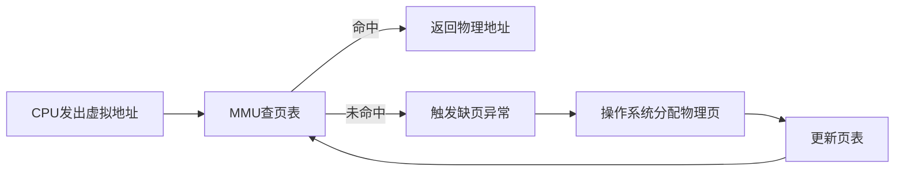

# MMU（内存管理单元）原理

## 面试高频问答总结

### 1. MMU的作用是什么？
- 地址转换：将CPU发出的虚拟地址（VA）转换为物理地址（PA）。
- 内存保护：通过权限控制，防止非法访问。
- 进程隔离：每个进程有独立的虚拟空间，互不干扰。

### 2. MMU是如何实现地址转换的？
- 通过页表（Page Table）实现虚拟地址到物理地址的映射。
- TLB（快表）缓存最近的映射，加速查找。

#### 地址转换流程图

#### 举例说明
| 虚拟地址（VA） | 页号 | 偏移 | 页表查找 | 物理页号 | 物理地址（PA） |
| ------------- | ---- | ---- | -------- | -------- | -------------- |
| 0x12345678    | 0x1234 | 0x5678 | 页表[0x1234] | 0xABCD | 0xABCD5678    |

### 3. MMU如何实现内存保护和隔离？
- 每个进程有独立页表，互不干扰。
- 页表项有权限位（如只读/可写/可执行），非法访问会被MMU拦截。

#### 权限控制举例
| 进程 | 虚拟页号 | 物理页号 | 权限 |
| ---- | -------- | -------- | ---- |
| A    | 0x0001   | 0x1001   | 读写 |
| B    | 0x0001   | 0x2001   | 只读 |

### 4. 不同系统下MMU实现有何区别？
| 系统         | 页表结构   | 保护粒度 | 备注           |
| ------------ | ---------- | -------- | -------------- |
| Linux/Windows| 多级页表   | 细致     | 支持虚拟内存   |
| 嵌入式RTOS   | 简单页表/无MMU | 粗略   | 资源有限，功能简化 |
| ARM Cortex-M | MPU        | 区域保护 | 只有保护功能   |

### 5. 形象比喻
- MMU像“翻译官”，页表像“字典”，TLB像“速查表”。
- 权限位像“门禁卡”，没有权限就进不去。

---

[返回总目录](README.md)
