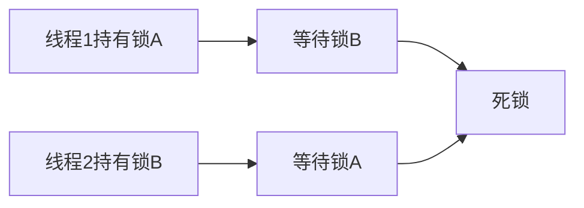

# 自旋锁、互斥锁、信号量、原子操作

## 面试高频问答总结

### 1. 常见的同步机制有哪些？
- 自旋锁：忙等，适合短时间锁定，多核常用。
- 互斥锁：阻塞等待，适合长时间锁定。
- 信号量：可用于同步或资源计数。
- 原子操作：单条指令完成，防止并发冲突。

### 2. 自旋锁和互斥锁的区别？
| 类型   | 等待方式 | 适用场景     | 是否可中断 |
| ------ | -------- | ------------ | ---------- |
| 自旋锁 | 忙等     | 短临界区/多核 | 否         |
| 互斥锁 | 阻塞     | 长临界区/单核 | 是         |

### 3. 死锁和竞态条件是什么？如何避免？
- 死锁：多个线程互相等待，程序卡死。
- 竞态：多个线程并发修改数据，结果不可预期。
- 避免：加锁顺序一致、减少锁粒度、用原子操作。

#### 死锁示意流程图

### 4. 形象比喻
- 自旋锁像“排队等电梯”，互斥锁像“领号等叫号”，信号量像“停车场剩余车位牌”，原子操作像“单人操作按钮”。

---

[返回总目录](README.md)
