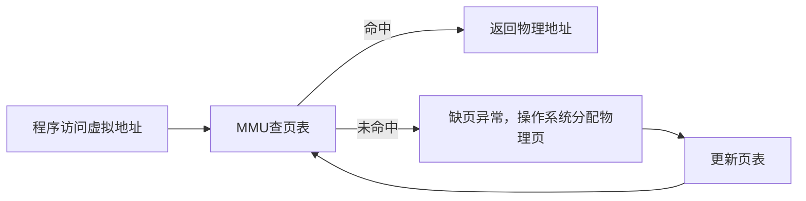

# 虚拟地址与物理地址的区别与转换

## 面试高频问答总结

### 1. 什么是虚拟地址和物理地址？
- 虚拟地址（VA）：程序看到和使用的地址，由操作系统分配。
- 物理地址（PA）：实际硬件内存的地址。

### 2. 为什么要有虚拟地址？
- 进程隔离：每个进程有独立空间，互不干扰。
- 内存保护：防止非法访问。
- 灵活分配：便于内存管理和扩展。

### 3. 虚拟地址如何转换为物理地址？
- 通过页表（Page Table）映射。
- MMU负责查表并完成转换。

#### 地址转换流程图

#### 举例说明
| 虚拟地址（VA） | 页号 | 偏移 | 页表查找 | 物理页号 | 物理地址（PA） |
| ------------- | ---- | ---- | -------- | -------- | -------------- |
| 0x7FFF1234    | 0x7FFF | 0x1234 | 页表[0x7FFF] | 0x1A2B | 0x1A2B1234    |

### 4. 地址转换对性能有影响吗？
- 有，频繁查页表会慢，TLB（快表）可加速。

### 5. 形象比喻
- 虚拟地址像“门牌号”，物理地址像“实际房间号”，MMU和页表像“前台查房间分配表”。

---

[返回总目录](README.md)
