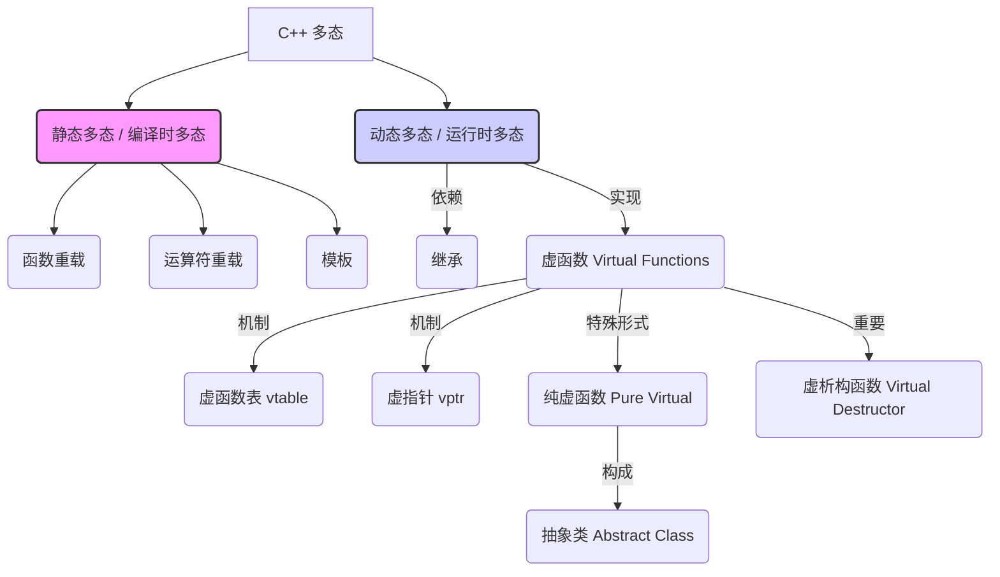

# C++ 多态详解 (面试向)

## 1. 什么是多态？

**概念与来源:**

多态 (Polymorphism) 源于希腊语，意为 "多种形态"。在面向对象编程 (OOP) 中，多态是指**同一接口或操作作用于不同的对象实例时，会产生不同的行为结果**。它是 OOP 的三大核心特性（封装、继承、多态）之一，旨在提高代码的灵活性、可扩展性和可维护性。

C++ 中的多态主要分为静态多态和动态多态。
*   **静态多态**在编译时解析，如函数重载和模板。
*   **动态多态**则在运行时解析，其核心特性是允许你**使用基类的指针或引用来调用派生类中重写 (override) 的虚方法**，从而在运行时根据对象的实际类型执行不同的代码。

**核心思想:** "一个接口，多种实现"。动态多态尤其体现了这一点。

## 2. C++ 中的多态类型

C++ 支持两种主要的多态类型：

*   **静态多态 (编译时多态):** 在程序编译期间确定调用哪个函数。效率高，但灵活性相对较低。
*   **动态多态 (运行时多态):** 在程序运行期间根据对象的实际类型确定调用哪个函数。灵活性高，但有轻微的运行时开销。

### 多态实现方式概览图



## 3. 静态多态 (编译时多态)

静态多态主要通过以下两种方式实现：

### 3.1 函数重载 (Function Overloading)

*   **定义:** 允许在同一作用域内定义多个同名函数，但它们的参数列表必须不同 (参数个数、类型或顺序不同)。
*   **原理:** 编译器在编译时根据函数调用时提供的实参类型、数量和顺序来选择最匹配的函数版本。
*   **示例:**
    ```cpp
    #include <iostream>

    void print(int i) {
        std::cout << "Printing int: " << i << std::endl;
    }

    void print(double f) {
        std::cout << "Printing float: " << f << std::endl;
    }

    void print(const char* s) {
        std::cout << "Printing string: " << s << std::endl;
    }

    int main() {
        print(10);       // 调用 print(int)
        print(3.14);     // 调用 print(double)
        print("hello");  // 调用 print(const char*)
        return 0;
    }
    ```
*   **优点:** 直观，易于使用。
*   **缺点:** 仅限于参数列表不同的情况，无法基于返回值类型重载。

### 3.2 运算符重载 (Operator Overloading)

*   **定义:** 允许为自定义类型 (类或结构体) 重新定义 C++ 内置运算符 (如 `+`, `-`, `*`, `/`, `<<`, `>>`, `[]` 等) 的行为。
*   **原理:** 编译器将运算符的使用转换为对特定重载运算符函数的调用。
*   **示例:**
    ```cpp
    #include <iostream>

    class Complex {
    public:
        double real, imag;
        Complex(double r = 0.0, double i = 0.0) : real(r), imag(i) {}

        // 重载 + 运算符
        Complex operator+(const Complex& other) const {
            return Complex(real + other.real, imag + other.imag);
        }

        // 重载 << 运算符 (通常作为友元函数)
        friend std::ostream& operator<<(std::ostream& os, const Complex& c) {
            os << c.real << " + " << c.imag << "i";
            return os;
        }
    };

    int main() {
        Complex a(1.0, 2.0);
        Complex b(3.0, 4.0);
        Complex c = a + b; // 调用 operator+
        std::cout << "a = " << a << std::endl; // 调用 operator<<
        std::cout << "b = " << b << std::endl;
        std::cout << "c = a + b = " << c << std::endl;
        return 0;
    }
    ```
*   **优点:** 使自定义类型的操作更自然、更符合直觉。
*   **缺点:** 可能被滥用，导致代码难以理解。某些运算符不能被重载 (如 `.` , `::`, `sizeof`, `?:`)。

### 3.3 模板 (Templates)

*   **定义:** 允许编写与类型无关的代码。编译器根据模板实例化时提供的具体类型生成相应的代码。包括函数模板和类模板。
*   **原理:** 编译时代码生成。编译器为每种用到的类型生成一个特定版本的函数或类。
*   **示例 (函数模板):**
    ```cpp
    #include <iostream>

    template <typename T>
    T maxVal(T a, T b) {
        return (a > b) ? a : b;
    }

    int main() {
        std::cout << "Max(10, 20): " << maxVal(10, 20) << std::endl;       // 实例化为 maxVal<int>
        std::cout << "Max(3.14, 1.618): " << maxVal(3.14, 1.618) << std::endl; // 实例化为 maxVal<double>
        // std::cout << maxVal(10, 3.14); // 编译错误，类型不匹配
        return 0;
    }
    ```
*   **优点:** 代码复用性极高，类型安全，性能接近手写代码。
*   **缺点:** 编译时间可能增加，错误信息有时不够友好，可能导致代码膨胀 (code bloat)。

## 4. 动态多态 (运行时多态)

动态多态是 OOP 中最常提到的多态形式，主要依赖于**继承**和**虚函数 (Virtual Functions)**。**其核心机制在于允许通过基类指针或引用调用派生类重写的虚函数，实现运行时的行为决策。**

### 4.1 实现机制

1.  **继承:** 必须存在一个基类和至少一个派生类。派生类继承基类的成员。
2.  **虚函数:** 在基类中使用 `virtual` 关键字声明的成员函数。派生类可以**重写 (override)** 这个虚函数，提供自己的实现。
3.  **基类指针或引用:** 通过指向派生类对象的基类指针或引用来调用虚函数。

### 4.2 `virtual` 关键字与虚函数表 (vtable)

*   **`virtual` 关键字:** 告诉编译器这个函数可能在派生类中被重写，并且对该函数的调用应该在运行时确定。
*   **虚函数表 (vtable):** 当一个类包含虚函数 (或继承自包含虚函数的基类) 时，编译器通常会为该类创建一个静态的虚函数表 (vtable)。vtable 是一个函数指针数组，存储了类中所有虚函数的地址。
*   **虚指针 (vptr):** 编译器会为每个包含 vtable 的类的对象实例添加一个隐藏的成员——虚指针 (vptr)。vptr 指向该对象所属类的 vtable。
*   **调用过程:**
    1.  当通过基类指针或引用调用虚函数时 (如 `basePtr->virtualFunc()`)。
    2.  程序首先通过对象的 vptr 找到对应的 vtable。
    3.  然后在 vtable 中查找被调用虚函数的地址。
    4.  最后调用该地址对应的函数。由于派生类对象的 vptr 指向派生类的 vtable (其中包含了重写后的函数地址)，因此最终会调用派生类的实现。

### 4.3 示例

```cpp
#include <iostream>
#include <string>
#include <vector>
#include <memory> // For std::shared_ptr

// 基类
class Shape {
public:
    // 虚函数
    virtual void draw() const {
        std::cout << "Drawing a generic shape." << std::endl;
    }
    // 虚析构函数 (重要!)
    virtual ~Shape() {
        std::cout << "Destroying Shape." << std::endl;
    }
};

// 派生类 Circle
class Circle : public Shape {
private:
    double radius;
public:
    Circle(double r) : radius(r) {}
    // 重写 (override) 基类的虚函数
    void draw() const override { // 'override' 关键字 (C++11) 推荐使用，用于检查是否正确重写
        std::cout << "Drawing a circle with radius " << radius << "." << std::endl;
    }
    ~Circle() override {
        std::cout << "Destroying Circle." << std::endl;
    }
};

// 派生类 Rectangle
class Rectangle : public Shape {
private:
    double width, height;
public:
    Rectangle(double w, double h) : width(w), height(h) {}
    // 重写 (override) 基类的虚函数
    void draw() const override {
        std::cout << "Drawing a rectangle with width " << width << " and height " << height << "." << std::endl;
    }
     ~Rectangle() override {
        std::cout << "Destroying Rectangle." << std::endl;
    }
};

// 使用多态的函数
void drawShapes(const std::vector<std::shared_ptr<Shape>>& shapes) {
    std::cout << "\n--- Drawing all shapes ---" << std::endl;
    for (const auto& shapePtr : shapes) {
        shapePtr->draw(); // 运行时决定调用哪个 draw() 版本
    }
    std::cout << "------------------------\n" << std::endl;
}

int main() {
    std::vector<std::shared_ptr<Shape>> myShapes;

    // 使用基类指针指向派生类对象
    myShapes.push_back(std::make_shared<Circle>(5.0));
    myShapes.push_back(std::make_shared<Rectangle>(4.0, 6.0));
    myShapes.push_back(std::make_shared<Shape>()); // 也可以添加基类对象

    drawShapes(myShapes);

    // 观察析构函数的调用顺序 (由于虚析构函数，会正确调用派生类析构函数)
    std::cout << "--- Exiting main ---" << std::endl;
    return 0;
}
```

### 4.4 虚析构函数 (Virtual Destructor)

*   **为什么需要?** 如果基类的析构函数不是虚函数，那么当你通过基类指针 `delete` 一个派生类对象时，只会调用基类的析构函数，派生类的析构函数不会被调用。这可能导致派生类分配的资源无法释放，造成内存泄漏或资源泄漏。
*   **规则:** 如果一个类打算作为基类，并且可能通过基类指针删除派生类对象，那么**必须**将其析构函数声明为 `virtual`。
*   **效果:** 将析构函数声明为 `virtual` 后，`delete basePtr;` 会首先调用派生类的析构函数，然后自动调用基类的析构函数，确保对象被完全、正确地销毁。

### 4.5 纯虚函数 (Pure Virtual Function) 与抽象类 (Abstract Class)

*   **纯虚函数:** 在声明虚函数时，在末尾加上 `= 0`。它没有函数体定义。
    ```cpp
    virtual void mustBeImplemented() const = 0;
    ```
*   **抽象类:** 包含至少一个纯虚函数的类称为抽象类。
*   **特点:**
    *   抽象类**不能被实例化** (不能创建抽象类的对象)。
    *   抽象类主要用作**接口**，强制派生类必须实现其所有纯虚函数。如果派生类没有实现所有继承的纯虚函数，那么该派生类仍然是抽象类。
*   **示例:**
    ```cpp
    // 抽象基类
    class AbstractShape {
    public:
        virtual void draw() const = 0; // 纯虚函数
        virtual double area() const = 0; // 纯虚函数
        virtual ~AbstractShape() = default; // 抽象类也应该有虚析构函数
    };

    class ConcreteCircle : public AbstractShape {
    private:
        double radius;
    public:
        ConcreteCircle(double r) : radius(r) {}
        void draw() const override { /* ... */ }
        double area() const override { return 3.14159 * radius * radius; }
    };

    int main() {
        // AbstractShape shape; // 错误！不能实例化抽象类
        AbstractShape* ptr = new ConcreteCircle(5.0); // 正确
        ptr->draw();
        std::cout << "Area: " << ptr->area() << std::endl;
        delete ptr;
        return 0;
    }
    ```

## 5. 多态的优缺点

**优点 (主要针对动态多态):**

*   **可扩展性 (Extensibility):**
    *   **动态多态:** 可以轻松添加新的派生类（例如，新的 `Shape` 子类 `Triangle`），而无需修改任何使用了基类指针/引用的现有代码（如 `drawShapes` 函数）。只需要新类继承基类并实现虚函数即可。这完全符合“开闭原则”（对扩展开放，对修改关闭）。
    *   **静态多态 (对比):** 如果使用函数重载来处理不同形状，`void draw(Circle c)`, `void draw(Rectangle r)`，那么添加 `Triangle` 时，不仅要添加 `void draw(Triangle t)`，还需要在使用这些函数的地方可能需要增加新的调用分支或修改模板实例化，扩展性相对受限。

*   **灵活性 (Flexibility):**
    *   **动态多态:** 允许在运行时处理一个容器中混合的不同类型的对象（只要它们都继承自同一个基类），并对它们执行相同的操作（调用虚函数），程序会自动选择正确的实现。调用者无需知道对象的具体类型。
    *   **静态多态 (对比):** 函数重载或模板通常需要在编译时知道所有可能的类型组合。处理异构集合（不同类型的对象放在一起）比较困难，通常需要 `std::variant` (C++17) 或其他类型擦除技术，或者依赖于编译时的类型推导。

*   **可维护性 (Maintainability):**
    *   **动态多态:** 代码逻辑更清晰、更集中。处理不同类型对象的通用逻辑（如遍历、调用 `draw`）位于使用基类接口的代码中，而每种类型的具体行为（如何 `draw`）则封装在各自的派生类中。修改某个类型的行为只需要修改对应的派生类，降低了代码耦合度。
    *   **静态多态 (对比):** 如果用函数重载，当类型很多或者行为复杂时，可能会导致大量的重载函数。如果用模板，复杂的模板代码可能难以阅读和调试。如果不同类型有相似逻辑，可能导致代码重复或需要复杂的模板元编程技巧来抽象。

*   **代码复用 (Code Reuse):** 通过继承复用基类的公共属性和非虚方法，通过接口（虚函数）复用调用逻辑。

**缺点:**

*   **运行时开销 (动态多态):**
    *   需要通过 vtable 查找函数地址，有轻微的性能损失 (通常是一两次额外的内存访问和一次间接函数调用)。对于性能极其敏感的代码段（如底层渲染循环、高频计算），这可能是需要考虑的因素。
    *   对象需要额外的 vptr 空间开销（通常一个指针的大小）。
*   **复杂性:** 对于不熟悉 OOP 的开发者来说，继承体系、虚函数、vtable 等概念的理解和调试可能更困难。
*   **静态类型检查的局限 (动态多态):** 编译器在编译时只能检查基类接口的调用是否合法，无法保证派生类实现的逻辑正确性（这需要运行时测试）。

## 6. 静态多态 vs 动态多态：区别与应用场景

| 特性         | 静态多态 (编译时)                     | 动态多态 (运行时)                         |
| :----------- | :------------------------------------ | :---------------------------------------- |
| **绑定时机** | 编译期间确定调用哪个函数             | 运行期间根据对象实际类型确定调用哪个函数 |
| **实现方式** | 函数重载、运算符重载、模板             | 继承、虚函数 (virtual)、基类指针/引用     |
| **性能开销** | 基本无运行时开销，效率高             | 有运行时开销 (vtable查找、vptr空间)       |
| **灵活性**   | 相对较低，编译时需确定类型           | 非常高，轻松处理异构集合和未知类型       |
| **可扩展性** | 添加新类型可能需要修改多处代码       | 易于扩展，符合开闭原则                   |
| **主要优势** | 高性能、泛型编程能力 (模板)          | 灵活性、可扩展性、可维护性               |

**使用场景与好处:**

*   **选择静态多态的情况 (好处：性能、编译期确定性):**
    *   **性能关键路径:** 当每一纳秒都很重要时，避免虚函数调用开销。
    *   **泛型编程:** 需要编写适用于多种数据类型的高效算法或数据结构时（如 STL 中的容器和算法），模板是最佳选择。
    *   **运算符重载:** 使自定义类的操作（如数学向量、复数）更自然直观。
    *   **简单的功能区分:** 参数类型或数量不同的相似功能（如不同的 `print` 函数）。

*   **选择动态多态的情况 (好处：灵活性、应对变化):**
    *   **处理异构集合:** 当你需要管理一个包含多种不同类型对象（但它们有共同基类/接口）的集合时，例如一个 `Shape` 数组包含 `Circle` 和 `Rectangle`。
    *   **框架和库设计:** 设计需要用户扩展的框架（如 GUI 库的控件、插件系统、事件处理系统），用户可以通过继承和重写虚函数来自定义行为。
    *   **面向接口编程:** 当你希望代码依赖于抽象接口而不是具体实现时，提高代码的解耦度和可测试性。
    *   **状态模式、策略模式等设计模式:** 这些模式通常依赖于动态多态来在运行时改变对象的行为。

**总结:** 静态多态和动态多态各有优劣，适用于不同的场景。静态多态追求编译时的效率和确定性，而动态多态则提供了运行时的灵活性和对未来变化的适应能力。在实际开发中，常常会结合使用两者。

## 7. 面试中的 C++ 多态

面试官考察 C++ 多态时，通常关注以下几点：

*   **基本概念:** 能否清晰解释什么是多态，以及静态多态和动态多态的区别。
*   **实现机制:**
    *   静态多态：函数重载、运算符重载、模板的原理和用法。
    *   动态多态：虚函数、vtable、vptr 的工作原理。为什么需要虚函数？
*   **虚析构函数:** 为什么基类的析构函数通常需要是虚函数？不使用虚析构函数会有什么后果？
*   **纯虚函数与抽象类:** 它们的作用是什么？何时使用？
*   **`override` 和 `final` (C++11):** `override` 的作用（保证正确重写，提高可读性），`final` 的作用（阻止派生类进一步重写虚函数或阻止类被继承）。
*   **场景应用:** 能否举例说明多态在实际项目中的应用场景 (例如，图形界面库的控件、游戏引擎的实体、插件系统等)。
*   **性能考量:** 是否了解动态多态的性能开销，以及在性能敏感场景下如何权衡。
*   **与其它语言多态的比较 (加分项):** 如果了解 Java 的接口或 Python 的鸭子类型，可以进行对比。

    *   **Python 的鸭子类型 (Duck Typing):**
        *   **核心思想:** "If it walks like a duck and quacks like a duck, then it must be a duck." （如果走起来像鸭子，叫起来像鸭子，那它就是鸭子）。关注对象的行为（具有哪些方法和属性），而不是对象的类型本身。
        *   **实现:** Python 是动态类型语言，不需要显式声明接口或继承关系来实现多态。只要一个对象具有被调用方法（例如 `draw()`），就可以在需要该行为的地方使用它，无论它是什么具体类型。
        *   **示例:**
            ```python
            class Circle:
                def draw(self):
                    print("Drawing a circle")

            class Rectangle:
                def draw(self):
                    print("Drawing a rectangle")

            class CustomShape:
                # 没有继承任何基类
                def draw(self):
                    print("Drawing a custom shape")

            def draw_all(shapes):
                for shape in shapes:
                    shape.draw() # 只要对象有 draw() 方法就能调用

            my_shapes = [Circle(), Rectangle(), CustomShape()]
            draw_all(my_shapes)
            ```
        *   **与 C++ 对比:**
            *   **类型检查:** C++ 动态多态依赖 `virtual` 和继承，编译器会进行一定的接口检查（基类指针只能调用基类声明的虚函数）。Python 在调用时才检查对象是否有对应方法，如果没有则抛出运行时错误 (AttributeError)。
            *   **显式 vs 隐式:** C++ 多态通常需要显式的继承关系和 `virtual` 关键字。Python 的鸭子类型是隐式的，基于对象实际拥有的方法。
            *   **灵活性 vs 安全性:** 鸭子类型非常灵活，但也牺牲了编译时的类型安全检查。

**回答技巧:**

*   **条理清晰:** 先定义，再分类，然后详细解释每种类型的实现机制和示例。
*   **突出重点:** 强调虚函数、vtable、虚析构函数在动态多态中的核心作用。
*   **结合实例:** 使用简洁明了的代码示例辅助说明。
*   **说明优缺点:** 展示对技术的全面理解，包括其适用场景和局限性。
*   **联系实际:** 如果有相关项目经验，可以结合项目说明多态的应用。

掌握 C++ 多态是理解和运用面向对象编程的关键，也是 C++ 面试中的高频考点。务必深入理解其原理和应用。
