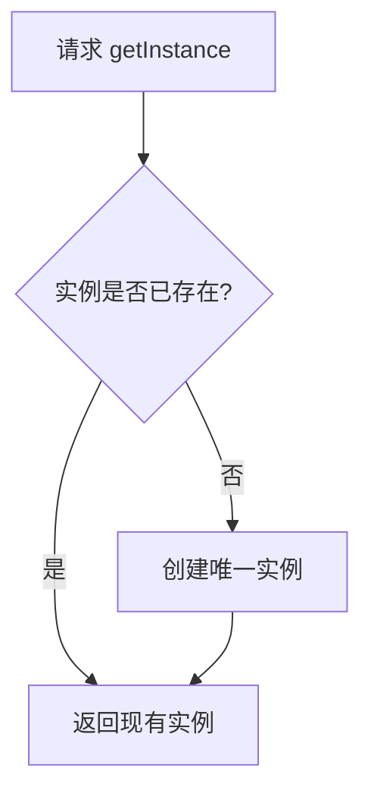

# 单例模式 - 参考答案

- [返回题目](./questions.md) | [返回目录](../README.md)
- 关联模式： [工厂方法](../02-工厂方法模式/questions.md)、[代理](../05-代理模式/questions.md)

## 1) 定义与核心问题
单例模式保证“一个类在系统中只有一个实例”，并提供全局访问点。核心是：**控制实例数量**与**统一访问入口**。

## 2) 关键组成
- 私有化构造方法（外部不能随意 new）。
- 类内部持有唯一实例。
- 对外提供获取实例的方法（如 `getInstance()`）。

## 3) 饿汉 vs 懒汉
- 饿汉：类加载时创建，简单、线程安全，可能造成提前占用资源。
- 懒汉：首次使用时创建，节省启动资源，但要解决并发安全。

## 4) 线程安全为何困难
多线程下，若两个线程同时发现“实例为空”，都去创建对象，会产生多个实例，违反单例约束。

## 5) DCL + 内存语义
DCL 能减少锁开销，但需要 `volatile`（或语言等价机制）防止指令重排，避免拿到“未完全初始化”的对象。

## 6) 破坏方式与防护
- 反射强行调用构造器：在构造器里增加防重复校验。
- 序列化反序列化产生新对象：实现 `readResolve`（或语言等价机制）。

## 7) 缺点与不适用场景
- 全局状态可能增加耦合，影响测试（难以 mock）。
- 生命周期过长，资源释放难。
- 如果业务需要多实例（如多租户配置），单例反而不合适。

## 8) 项目落地答法
面试可从三点回答：
1. 线程安全策略（初始化时机 + 并发控制）。
2. 可测试性（接口抽象、依赖注入减弱硬编码）。
3. 生命周期与资源管理（是否需要销毁、热更新）。

## 知识点速记
- 本质：受控创建 + 全局访问。
- 难点：并发、反射、序列化。
- 原则：能不用全局状态就不用。

