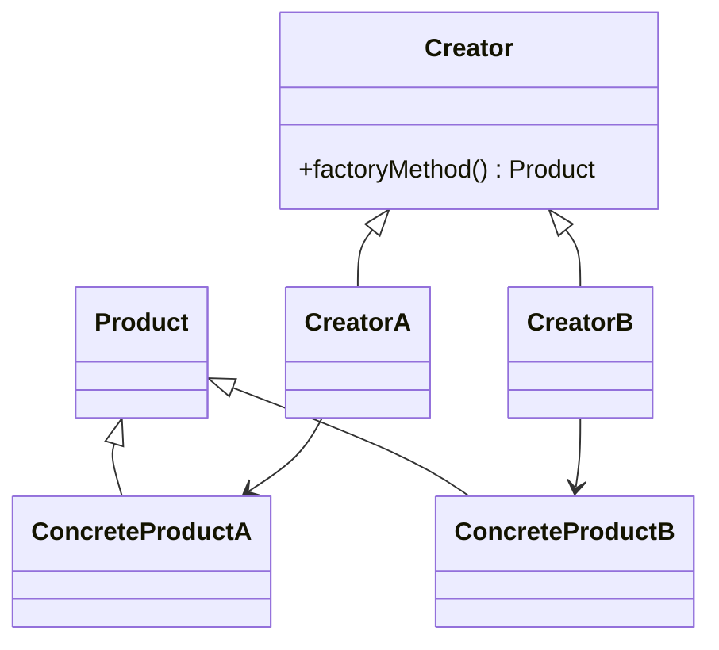

# 工厂方法模式 - 参考答案

- [返回题目](./questions.md) | [返回目录](../README.md)
- 关联模式： [单例](../01-单例模式/questions.md)、[策略](../03-策略模式/questions.md)

## 1) 定义与区别
工厂方法模式将“创建对象”的职责下放给子类工厂。与简单工厂相比，它不是用一个大 `switch` 集中创建，而是通过扩展新工厂支持新产品。

## 2) 核心角色
- 抽象产品（Product）
- 具体产品（ConcreteProduct）
- 抽象工厂（Creator）
- 具体工厂（ConcreteCreator）

## 3) 开闭原则体现
新增产品时，新增“具体产品 + 对应工厂”，原有工厂和客户端逻辑可保持不变。

## 4) 适用场景
- 对象创建复杂（参数多、前置校验多）。
- 客户端不想依赖具体类。
- 产品族可能持续扩展。

## 5) 优点与代价
优点：解耦创建与使用、扩展性好。  
代价：类数量增加，理解和维护成本上升。

## 6) 与抽象工厂区别
- 工厂方法：通常聚焦“一个产品等级结构”的创建。
- 抽象工厂：一次创建“多个关联产品（产品族）”。

## 7) 控制膨胀的方法
- 用注册表 + 反射/配置化减少重复模板代码。
- 合并变化不大的工厂实现。
- 在 DI 容器中用命名 Bean 管理实例。

## 8) DI 框架落地建议
让工厂依赖接口，由容器注入具体实现；工厂只负责编排，不负责硬编码具体类名。

## 知识点速记
- 重点：把 new 隔离起来。
- 真价值：扩展时少改旧代码。

