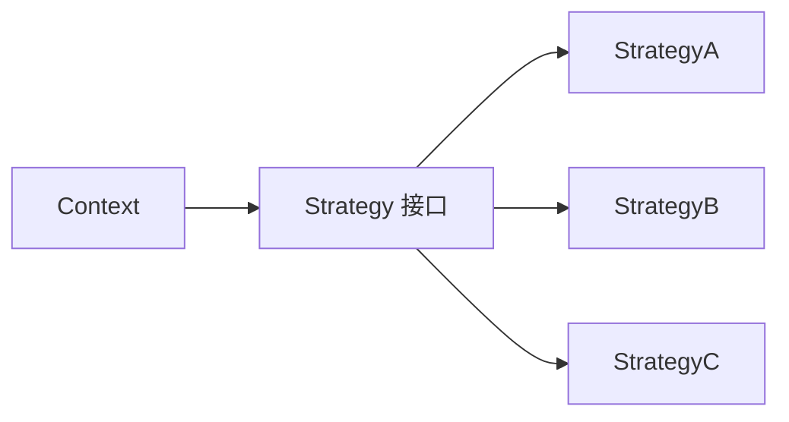

# 策略模式 - 参考答案

- [返回题目](./questions.md) | [返回目录](../README.md)
- 关联模式： [工厂方法](../02-工厂方法模式/questions.md)、[状态](../10-状态模式/questions.md)

## 1) 解决的问题
把“可互换的算法”封装成独立策略，客户端按需选择，避免业务逻辑里塞满分支判断。

## 2) 角色
- Strategy（策略接口）
- ConcreteStrategy（具体策略）
- Context（上下文，持有并调用策略）

## 3) 替代分支的方式
分支逻辑搬到多态实现中：不同策略对象实现同一接口，Context 只面向接口调用。

## 4) 与工厂方法配合
常见做法：工厂负责“根据条件选策略实例”，Context 负责“执行策略”。

## 5) 与状态模式区别
- 策略：重点在“外部选择算法”。
- 状态：重点在“对象内部状态变化驱动行为变化”。

## 6) 运行时切换
- 通过配置/参数动态选择策略。
- 保证策略接口幂等与线程安全。
- 对关键策略加兜底默认实现。

## 7) 常见误区
- 过度拆分类，导致小项目复杂化。
- 策略之间共享可变状态，造成并发风险。

## 8) 支付/促销场景
可按“支付渠道”“优惠规则”分两层策略；每层用注册表管理，实现新增渠道/规则时最小改动。

## 知识点速记
- 关键词：可替换算法。
- 实战组合：策略 + 工厂 + 配置中心。

