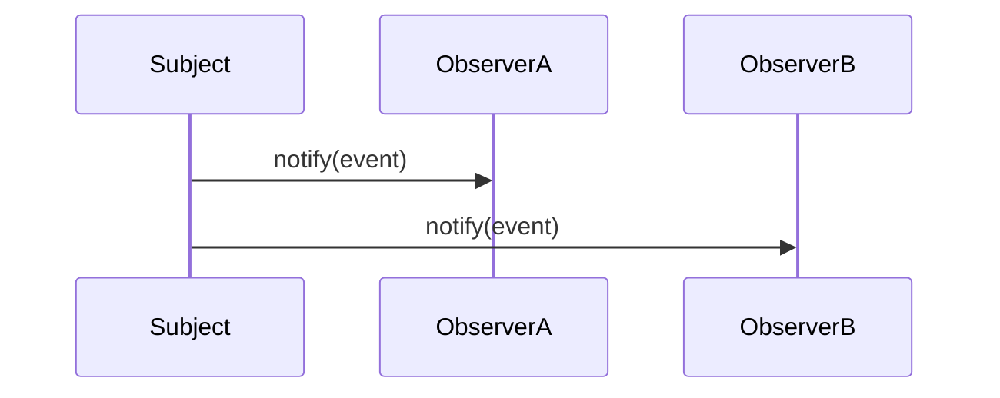

# 观察者模式 - 参考答案

- [返回题目](./questions.md) | [返回目录](../README.md)
- 关联模式： [责任链](../09-责任链模式/questions.md)、[策略](../03-策略模式/questions.md)

## 1) 核心思想
定义对象间一对多依赖：主题状态变化时，自动通知所有观察者。

## 2) 角色
- Subject（主题）
- Observer（观察者接口）
- ConcreteObserver（具体观察者）

## 3) 事件驱动常见原因
发布方不关心订阅方细节，实现低耦合扩展（新增订阅者通常无需改发布方）。

## 4) 同步 vs 异步
- 同步：实现简单、调用链清晰，但易被慢订阅者拖慢。
- 异步：吞吐高、解耦强，但要处理重试、顺序、幂等。

## 5) 性能优化
- 分组通知、批量推送。
- 过滤无关事件。
- 为重处理订阅者单独线程池。

## 6) 失败处理
- 超时控制 + 重试。
- 死信队列。
- 失败告警与人工补偿机制。

## 7) 与发布-订阅区别
观察者通常是对象内直接订阅关系；发布-订阅常引入消息中间件作为中介，解耦更彻底。

## 8) 微服务演进
从进程内观察者演进到 MQ/Kafka 事件总线，配合幂等键、重试策略、最终一致性设计。

## 知识点速记
- 本质：一对多通知。
- 工程重点：可靠投递、幂等、可观测性。

