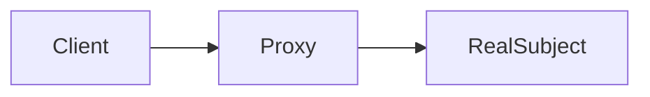

# 代理模式 - 参考答案

- [返回题目](./questions.md) | [返回目录](../README.md)
- 关联模式： [装饰器](../07-装饰器模式/questions.md)、[单例](../01-单例模式/questions.md)

## 1) 定义
代理模式为目标对象提供一个替身（代理），由代理控制对目标对象的访问。

## 2) 静态 vs 动态
- 静态代理：代理类手写，直观但类多。
- 动态代理：运行时生成代理类，灵活但调试复杂。

## 3) 常见场景
- 权限校验
- 缓存
- 日志埋点
- 远程调用封装

## 4) 与装饰器区别
- 代理更强调“访问控制”。
- 装饰器更强调“功能叠加增强”。

## 5) 不同代理类型
- 远程代理：隐藏远程通信细节。
- 虚拟代理：延迟加载重对象。
- 保护代理：控制访问权限。

## 6) 性能与调试取舍
动态代理减少样板代码，但会增加调用栈复杂度；需要配合日志、链路追踪工具。

## 7) AOP 关系
AOP 常通过动态代理织入横切逻辑（事务、日志、鉴权），代理是 AOP 落地手段之一。

## 8) 避免过度设计
只为“横切关注点”建代理；业务核心流程不要层层套壳。

## 知识点速记
- 关键词：控制访问。
- 高频组合：代理 + AOP + 缓存。

