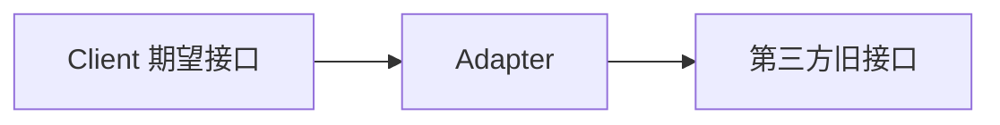

# 适配器模式 - 参考答案

- [返回题目](./questions.md) | [返回目录](../README.md)
- 关联模式： [代理](../05-代理模式/questions.md)、[工厂方法](../02-工厂方法模式/questions.md)

## 1) 典型问题
已有接口与目标接口不兼容，无法直接协作。

## 2) 类 vs 对象适配器
- 类适配器：通过继承适配，受语言单继承限制。
- 对象适配器：通过组合持有被适配对象，更灵活。

## 3) 优先对象适配器的原因
低耦合、可替换、便于测试与扩展，工程里更常见。

## 4) 与外观模式区别
- 适配器：转换接口。
- 外观：简化接口入口。

## 5) SDK 适配层职责
- 参数映射
- 异常码统一
- 重试与超时策略封装
- 屏蔽 SDK 版本差异

## 6) 防止万能层
明确边界：只做“协议转换”，不掺杂业务决策。

## 7) 性能成本
通常只有轻微方法转发开销，远小于网络与 IO 成本；重点关注可维护性收益。

## 8) 面向变更的设计
- 定义稳定的内部接口。
- 版本化适配器（v1/v2）。
- 用契约测试保障兼容。

## 知识点速记
- 核心：接口不兼容时的桥接器。
- 最佳实践：内部统一接口 + 多版本适配实现。

