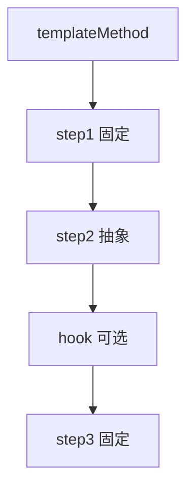

# 模板方法模式 - 参考答案

- [返回题目](./questions.md) | [返回目录](../README.md)
- 关联模式： [策略](../03-策略模式/questions.md)、[装饰器](../07-装饰器模式/questions.md)

## 1) 定义
在父类中定义算法骨架，把可变步骤延迟到子类实现。

## 2) 分工
- 模板方法：固定流程顺序（不可随意改）。
- 基本步骤方法：由子类具体实现差异逻辑。

## 3) 钩子方法
父类提供默认空实现或布尔判断点，子类可选择性重写，用于“可选步骤控制”。

## 4) 与策略区别
- 模板方法：通过继承复用流程。
- 策略：通过组合替换算法。

## 5) 防止上帝类
- 父类只保留稳定流程。
- 变化点拆到子类或协作组件。
- 控制抽象层级，避免过多可变步骤。

## 6) 复用与扩展平衡
把“稳定骨架”收敛在模板，把“变化点”限制在少量抽象方法。

## 7) 评审判断标准
- 流程是否稳定且有复用价值？
- 抽象方法数量是否合理？
- 子类是否只关心差异逻辑？

## 8) 审批流程示例
骨架：提交 -> 校验 -> 路由 -> 审批 -> 通知。  
不同审批类型只重写“路由规则”和“审批细节”。

## 知识点速记
- 核心：固定流程 + 延迟实现。
- 易错点：把不稳定流程硬塞进模板。

