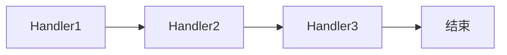

# 责任链模式 - 参考答案

- [返回题目](./questions.md) | [返回目录](../README.md)
- 关联模式： [观察者](../04-观察者模式/questions.md)、[状态](../10-状态模式/questions.md)

## 1) 基本思想
将多个处理节点连成一条链，请求沿链传递，直到被处理或链尾结束。

## 2) 核心角色
- Handler（处理器抽象）
- ConcreteHandler（具体处理器）
- Client（发起请求）

## 3) 降低耦合方式
客户端只需把请求交给链头，不关心具体由谁处理。

## 4) 中断与透传设计
- 中断：满足条件就停止后续处理。
- 透传：每个节点都执行，常见于审计/过滤场景。

## 5) 性能治理
- 节点按命中率排序。
- 快速失败（前置校验）。
- 异步化非关键节点。

## 6) 与过滤器链关系
过滤器链是责任链在 Web 中间件里的典型实现形态之一。

## 7) 失败兜底
- 统一异常处理节点。
- 默认处理器。
- 告警 + 重试/人工介入。

## 8) 可观测设计
为每个节点记录耗时、命中结果、错误码，输出链路追踪 ID 便于定位。

## 知识点速记
- 核心：请求沿链流动。
- 工程关键：顺序、终止条件、可观测。

