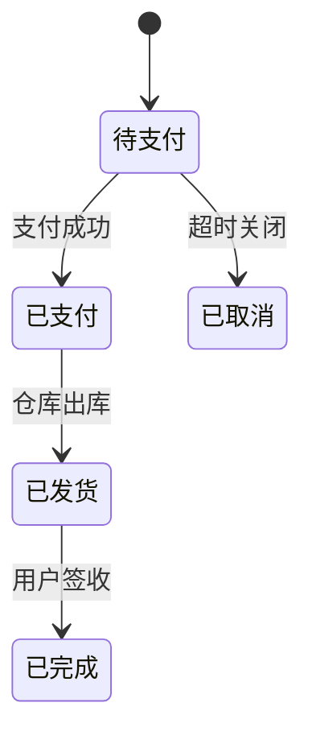

# 状态模式 - 参考答案

- [返回题目](./questions.md) | [返回目录](../README.md)
- 关联模式： [策略](../03-策略模式/questions.md)、[责任链](../09-责任链模式/questions.md)

## 1) 核心问题
对象行为随内部状态变化而变化，避免用大量条件分支硬编码状态逻辑。

## 2) 关键角色
- Context（上下文，持有当前状态）
- State（状态接口）
- ConcreteState（具体状态）

## 3) 避免分支方式
把“每个状态下的行为”封装到对应状态类中，由多态分发。

## 4) 切换逻辑放置
常见做法：
- 复杂状态机：迁移规则集中在 Context（更易统一校验）。
- 简单状态流：可放在具体 State，提升内聚。

## 5) 与策略混淆点
两者都用多态；差别是状态模式强调“状态演进和迁移约束”，策略模式强调“外部选择算法”。

## 6) 设计迁移图
先画合法迁移图，再把每条迁移映射到明确事件，非法迁移直接拒绝并记录。

## 7) 并发一致性
要关注重复提交、乱序更新；可通过版本号（CAS）、乐观锁、幂等键保证正确切换。

## 8) 订单系统落地
状态如“待支付 -> 已支付 -> 已发货 -> 已完成/已取消”。  
常见坑：未校验非法跳转、补偿流程缺失、超时关闭与支付回调并发冲突。

## 知识点速记
- 核心：状态驱动行为。
- 工程重点：状态迁移约束 + 并发一致性。

