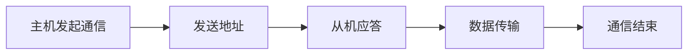

# 常见总线与协议

## 面试高频问答总结

### 1. 常见总线和协议有哪些？
| 总线/协议 | 典型用途     | 特点           |
| --------- | ------------ | -------------- |
| I2C       | 低速外设通信 | 简单、双线     |
| SPI       | 高速外设通信 | 多线、全双工   |
| UART      | 串口通信     | 简单、异步     |
| CAN       | 汽车/工业    | 抗干扰、仲裁   |
| DMA       | 内存/外设直传| CPU卸载       |

### 2. DMA的作用？
- 直接内存访问，提升数据传输效率，减少CPU负担。

#### 总线通信流程图（以I2C为例）

### 3. 形象比喻
- I2C像“公交车”，SPI像“出租车”，UART像“对讲机”，DMA像“快递员”。

---

[返回总目录](README.md)
