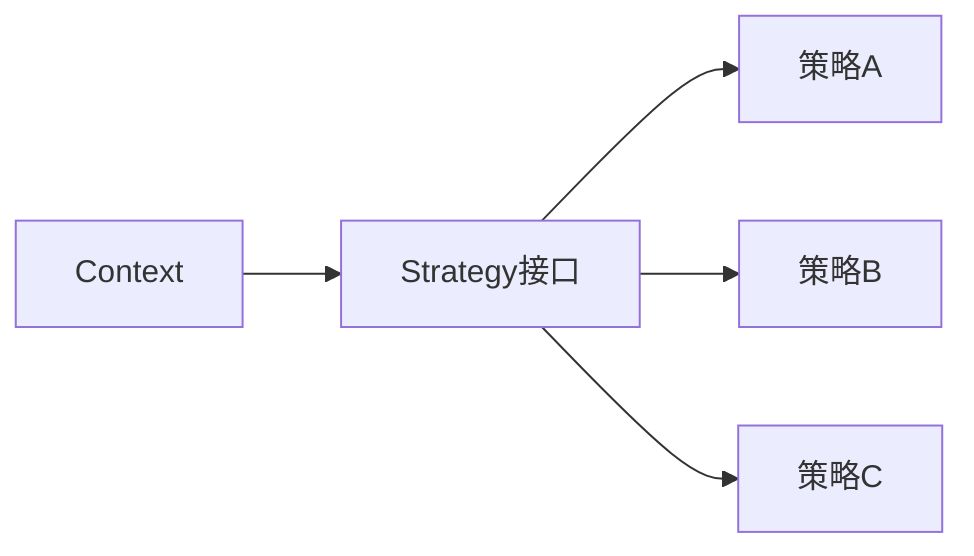

# 01-策略模式（答案）

- 返回题目：[./../01-策略模式.md](../01-策略模式.md)
- 返回总目录：[设计模式面试体系](../README.md)

## 一句话定义
把可互换算法封装为独立策略类，让调用方在运行时切换。

## 关键知识点
- 核心角色：Context（上下文）、Strategy（策略接口）、ConcreteStrategy（具体策略）。
- 优点：消除大段条件分支，提升扩展性。
- 风险：策略类数量上升，需要命名和目录管理。

## 图解（Mermaid）

## 面试答题模板（30~60秒）
1. 先说定义：把可互换算法封装为独立策略类，让调用方在运行时切换。
2. 再说适用场景与优缺点。
3. 最后给一个 C++ 落地点（接口抽象、智能指针、生命周期管理）。

## 关联概念跳转
- [模板方法模式题目](../05-模板方法模式.md)
- [C++ 多态详解](../../16-CPP多态详解.md)
