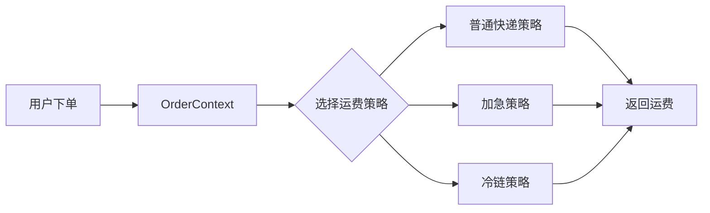

# 01-策略模式（答案）

- 返回题目：[./../01-策略模式.md](../01-策略模式.md)
- 返回总目录：[设计模式面试体系](../README.md)

## 一句话定义
把一组可互换的算法封装起来，在运行时按场景切换。

## 关键知识点
- 核心角色：`Context`（上下文）、`Strategy`（策略接口）、`ConcreteStrategy`（具体策略）。
- 本质是“组合优于继承”：把变化点（算法）从主流程中拆出去。
- 典型信号：同一业务流程里出现大量“按类型分支”的 `if-else/switch`。

## 这种模式的好处
- 减少条件分支，提升可读性和可维护性。
- 新增算法时通常只加新策略类，符合开闭原则。
- 便于单元测试：每个策略可独立测试。

## 实际例子（面试可直接复述）
电商平台的运费计算：普通快递、加急、冷链三种算法。下单时根据商品类型和时效要求切换策略。

## 流程图（Mermaid）

## 面试答题模板（30~60秒）
1. 先下定义：把一组可互换的算法封装起来，在运行时按场景切换。
2. 再讲一个真实业务例子，说明“为什么要用它”。
3. 最后补充优势与边界（什么时候不该用）。

## 关联概念跳转
- [模板方法模式题目](../05-模板方法模式.md)
- [C++ 多态详解](../../16-CPP多态详解.md)
