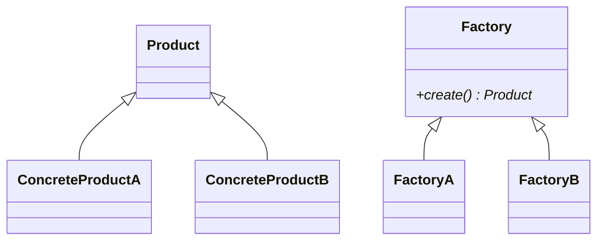

# 02-工厂方法模式（答案）

- 返回题目：[./../02-工厂方法模式.md](../02-工厂方法模式.md)
- 返回总目录：[设计模式面试体系](../README.md)

## 一句话定义
把对象创建延迟到子类工厂，调用方只依赖抽象产品接口。

## 关键知识点
- 角色：Product、ConcreteProduct、Factory、ConcreteFactory。
- 新增产品时增加新产品类 + 新工厂类，原调用方少改动。
- C++ 推荐返回 `std::unique_ptr<Product>`，明确所有权。

## 图解（Mermaid）

## 面试答题模板（30~60秒）
1. 先说定义：把对象创建延迟到子类工厂，调用方只依赖抽象产品接口。
2. 再说适用场景与优缺点。
3. 最后给一个 C++ 落地点（接口抽象、智能指针、生命周期管理）。

## 关联概念跳转
- [抽象工厂模式题目](../10-抽象工厂模式.md)
