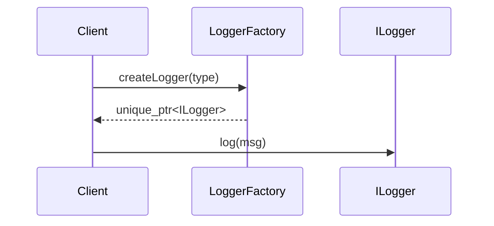

# 02-工厂方法模式（答案）

- 返回题目：[./../02-工厂方法模式.md](../02-工厂方法模式.md)
- 返回总目录：[设计模式面试体系](../README.md)

## 一句话定义
定义创建对象的接口，让子类决定实例化哪一种具体产品。

## 关键知识点
- 角色：`Product`、`ConcreteProduct`、`Factory`、`ConcreteFactory`。
- 客户端依赖抽象产品，不直接 `new` 具体类。
- C++ 实践建议：工厂返回 `std::unique_ptr<Product>`。

## 这种模式的好处
- 隔离创建细节，降低调用方耦合。
- 新增产品时改动集中，扩展路径清晰。
- 统一创建入口，便于日志、监控、缓存等横切能力注入。

## 实际例子（面试可直接复述）
日志系统支持 ConsoleLogger / FileLogger。配置切换后由不同工厂创建对应 Logger。业务代码只拿 `ILogger` 使用。

## 流程图（Mermaid）

## 面试答题模板（30~60秒）
1. 先下定义：定义创建对象的接口，让子类决定实例化哪一种具体产品。
2. 再讲一个真实业务例子，说明“为什么要用它”。
3. 最后补充优势与边界（什么时候不该用）。

## 关联概念跳转
- [抽象工厂模式题目](../10-抽象工厂模式.md)
