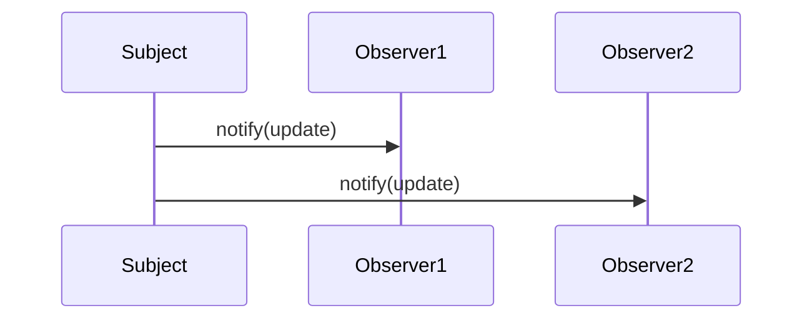

# 03-观察者模式（答案）

- 返回题目：[./../03-观察者模式.md](../03-观察者模式.md)
- 返回总目录：[设计模式面试体系](../README.md)

## 一句话定义
定义一对多依赖，被观察者状态变化时通知所有观察者。

## 关键知识点
- 角色：Subject、Observer。
- 同步通知简单直接；异步通知解耦更强但排障更难。
- C++ 可用弱引用或订阅 token 避免悬空回调。

## 图解（Mermaid）

## 面试答题模板（30~60秒）
1. 先说定义：定义一对多依赖，被观察者状态变化时通知所有观察者。
2. 再说适用场景与优缺点。
3. 最后给一个 C++ 落地点（接口抽象、智能指针、生命周期管理）。

## 关联概念跳转
- [代理模式题目](../08-代理模式.md)
