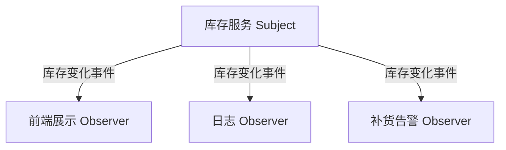

# 03-观察者模式（答案）

- 返回题目：[./../03-观察者模式.md](../03-观察者模式.md)
- 返回总目录：[设计模式面试体系](../README.md)

## 一句话定义
建立对象间一对多依赖，当主题状态变化时自动通知所有观察者。

## 关键知识点
- 角色：`Subject`（发布者）与 `Observer`（订阅者）。
- 主题只依赖观察者抽象，不关心具体订阅者类型。
- C++ 中建议用订阅 token / 弱引用避免悬空回调。

## 这种模式的好处
- 发布-订阅解耦，新增订阅者不影响发布者。
- 天然支持“一个事件触发多个动作”。
- 有利于模块化：UI、日志、告警可独立演进。

## 实际例子（面试可直接复述）
库存变化后，需要同时更新前端展示、写审计日志、触发补货告警。库存服务只负责发布“库存变更事件”。

## 流程图（Mermaid）

## 面试答题模板（30~60秒）
1. 先下定义：建立对象间一对多依赖，当主题状态变化时自动通知所有观察者。
2. 再讲一个真实业务例子，说明“为什么要用它”。
3. 最后补充优势与边界（什么时候不该用）。

## 关联概念跳转
- [代理模式题目](../08-代理模式.md)
