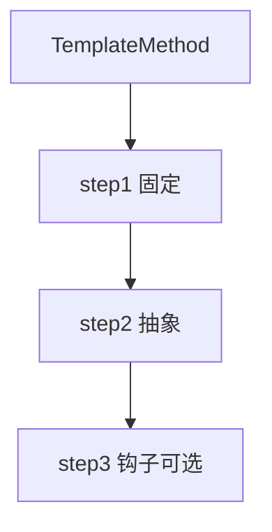

# 05-模板方法模式（答案）

- 返回题目：[./../05-模板方法模式.md](../05-模板方法模式.md)
- 返回总目录：[设计模式面试体系](../README.md)

## 一句话定义
在父类定义算法骨架，把可变步骤延迟到子类实现。

## 关键知识点
- “不变流程”放基类；“可变实现”放子类。
- 适合流程稳定、步骤可替换的场景。
- 可与 `final` 配合锁定主流程，避免子类破坏顺序。

## 图解（Mermaid）

## 面试答题模板（30~60秒）
1. 先说定义：在父类定义算法骨架，把可变步骤延迟到子类实现。
2. 再说适用场景与优缺点。
3. 最后给一个 C++ 落地点（接口抽象、智能指针、生命周期管理）。

## 关联概念跳转
- [策略模式题目](../01-策略模式.md)
