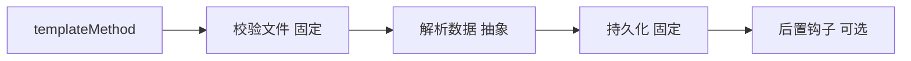

# 05-模板方法模式（答案）

- 返回题目：[./../05-模板方法模式.md](../05-模板方法模式.md)
- 返回总目录：[设计模式面试体系](../README.md)

## 一句话定义
在父类定义算法骨架，把可变步骤延迟到子类实现。

## 关键知识点
- “流程稳定，步骤可变”是使用模板方法的核心判断。
- 父类负责顺序与框架，子类负责具体细节。
- 可用钩子函数（hook）给子类“可选扩展点”。

## 这种模式的好处
- 主流程统一，减少重复代码。
- 关键步骤可控，防止子类随意改流程。
- 便于在父类统一注入监控、异常处理、埋点。

## 实际例子（面试可直接复述）
文件导入流程：`校验文件 -> 解析数据 -> 持久化`。CSV 和 JSON 导入在“解析数据”步骤不同，其余步骤一致。

## 流程图（Mermaid）

## 面试答题模板（30~60秒）
1. 先下定义：在父类定义算法骨架，把可变步骤延迟到子类实现。
2. 再讲一个真实业务例子，说明“为什么要用它”。
3. 最后补充优势与边界（什么时候不该用）。

## 关联概念跳转
- [策略模式题目](../01-策略模式.md)
