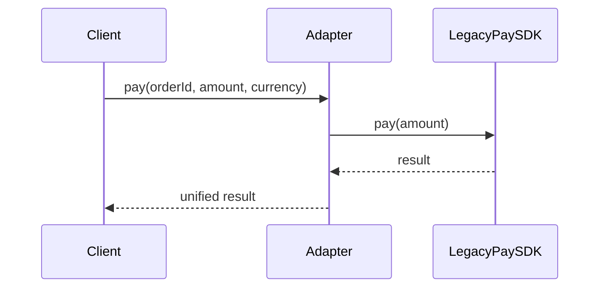

# 06-适配器模式（答案）

- 返回题目：[./../06-适配器模式.md](../06-适配器模式.md)
- 返回总目录：[设计模式面试体系](../README.md)

## 一句话定义
把一个不兼容的接口转换成客户端期望的接口。

## 关键知识点
- 重点是“接口转换”，不是“业务增强”。
- C++ 中对象适配器（组合）通常比类适配器更灵活。
- 适配层应尽量薄，避免堆积业务逻辑。

## 这种模式的好处
- 复用旧系统，减少重写成本。
- 平滑迁移：新旧系统可并存一段时间。
- 降低对外部第三方 API 变化的冲击。

## 实际例子（面试可直接复述）
旧支付 SDK 只提供 `pay(amount)`，新业务统一接口是 `pay(orderId, amount, currency)`，通过适配器转换参数与返回值。

## 流程图（Mermaid）

## 面试答题模板（30~60秒）
1. 先下定义：把一个不兼容的接口转换成客户端期望的接口。
2. 再讲一个真实业务例子，说明“为什么要用它”。
3. 最后补充优势与边界（什么时候不该用）。

## 关联概念跳转
- [代理模式题目](../08-代理模式.md)
