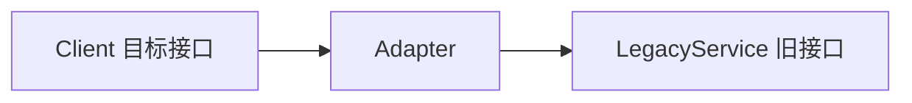

# 06-适配器模式（答案）

- 返回题目：[./../06-适配器模式.md](../06-适配器模式.md)
- 返回总目录：[设计模式面试体系](../README.md)

## 一句话定义
把不兼容接口转换为目标接口，让旧代码继续复用。

## 关键知识点
- 对象适配器（组合）在 C++ 中更常用。
- 适配器关注“接口转换”，外观关注“简化入口”。
- 适配层不宜承载过多业务，避免演化为“垃圾层”。

## 图解（Mermaid）

## 面试答题模板（30~60秒）
1. 先说定义：把不兼容接口转换为目标接口，让旧代码继续复用。
2. 再说适用场景与优缺点。
3. 最后给一个 C++ 落地点（接口抽象、智能指针、生命周期管理）。

## 关联概念跳转
- [代理模式题目](../08-代理模式.md)
