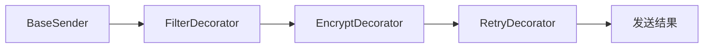

# 07-装饰器模式（答案）

- 返回题目：[./../07-装饰器模式.md](../07-装饰器模式.md)
- 返回总目录：[设计模式面试体系](../README.md)

## 一句话定义
在不修改原类的前提下，动态叠加对象职责。

## 关键知识点
- 装饰器与被装饰对象实现同一接口。
- 可多层叠加：每层只做一件增强功能。
- 顺序敏感：加密再压缩与压缩再加密结果可能不同。

## 这种模式的好处
- 运行时灵活组合能力，避免继承类爆炸。
- 单一职责更清晰：每个装饰器只负责一种增强。
- 原始组件保持稳定，风险更可控。

## 实际例子（面试可直接复述）
消息发送组件：基础发送 + 敏感词过滤 + 加密 + 重试。根据场景动态拼装装饰链。

## 流程图（Mermaid）

## 面试答题模板（30~60秒）
1. 先下定义：在不修改原类的前提下，动态叠加对象职责。
2. 再讲一个真实业务例子，说明“为什么要用它”。
3. 最后补充优势与边界（什么时候不该用）。

## 关联概念跳转
- [代理模式题目](../08-代理模式.md)
