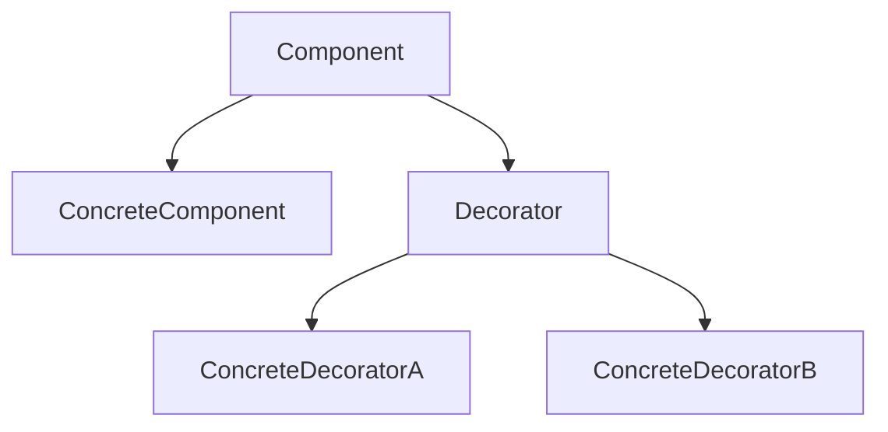

# 07-装饰器模式（答案）

- 返回题目：[./../07-装饰器模式.md](../07-装饰器模式.md)
- 返回总目录：[设计模式面试体系](../README.md)

## 一句话定义
通过包装对象动态叠加职责，而不是修改原类。

## 关键知识点
- 装饰器和被装饰对象实现同一接口。
- 可多层叠加；顺序不同，结果可能不同。
- C++ 用智能指针可降低多层包装的资源管理风险。

## 图解（Mermaid）

## 面试答题模板（30~60秒）
1. 先说定义：通过包装对象动态叠加职责，而不是修改原类。
2. 再说适用场景与优缺点。
3. 最后给一个 C++ 落地点（接口抽象、智能指针、生命周期管理）。

## 关联概念跳转
- [代理模式题目](../08-代理模式.md)
