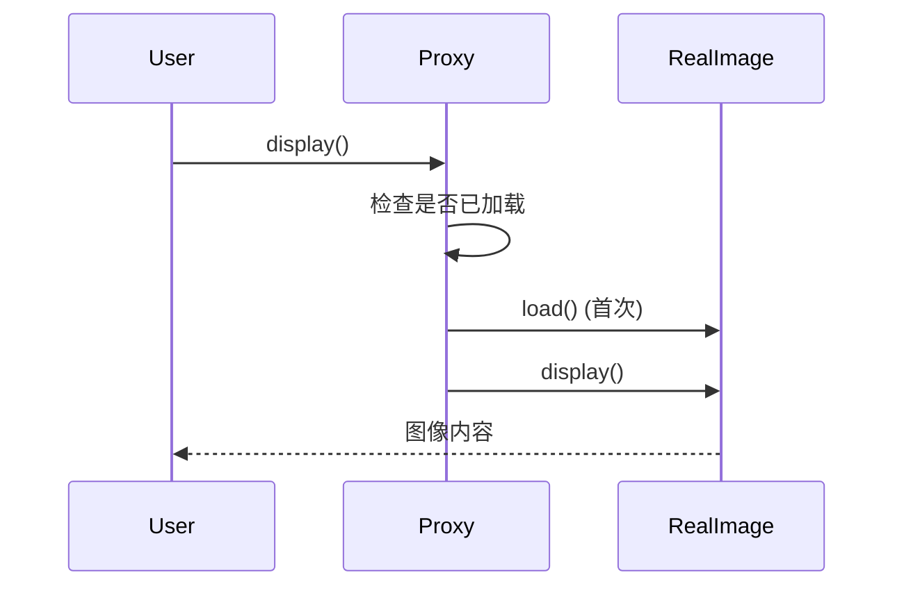

# 08-代理模式（答案）

- 返回题目：[./../08-代理模式.md](../08-代理模式.md)
- 返回总目录：[设计模式面试体系](../README.md)

## 一句话定义
通过代理对象控制对真实对象的访问。

## 关键知识点
- 代理与真实对象实现同一接口，客户端可无感替换。
- 常见类型：保护代理、虚拟代理、远程代理。
- 代理强调“访问控制/间接访问”，不是功能叠加。

## 这种模式的好处
- 可在访问前后统一做鉴权、缓存、限流、日志。
- 隔离复杂对象或远程调用细节，简化客户端。
- 支持延迟初始化，优化首屏或启动性能。

## 实际例子（面试可直接复述）
图片浏览器中大图懒加载：先返回代理对象展示占位图，真正查看时再加载原图。

## 流程图（Mermaid）

## 面试答题模板（30~60秒）
1. 先下定义：通过代理对象控制对真实对象的访问。
2. 再讲一个真实业务例子，说明“为什么要用它”。
3. 最后补充优势与边界（什么时候不该用）。

## 关联概念跳转
- [装饰器模式题目](../07-装饰器模式.md)
- [观察者模式题目](../03-观察者模式.md)
