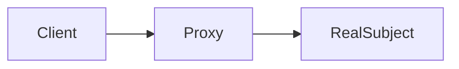

# 08-代理模式（答案）

- 返回题目：[./../08-代理模式.md](../08-代理模式.md)
- 返回总目录：[设计模式面试体系](../README.md)

## 一句话定义
由代理对象控制对真实对象的访问。

## 关键知识点
- 常见类型：保护代理、远程代理、虚拟代理。
- 代理与真实对象同接口，客户端可无缝替换。
- 优点是控制与扩展；代价是额外间接层。

## 图解（Mermaid）

## 面试答题模板（30~60秒）
1. 先说定义：由代理对象控制对真实对象的访问。
2. 再说适用场景与优缺点。
3. 最后给一个 C++ 落地点（接口抽象、智能指针、生命周期管理）。

## 关联概念跳转
- [装饰器模式题目](../07-装饰器模式.md)
- [观察者模式题目](../03-观察者模式.md)
