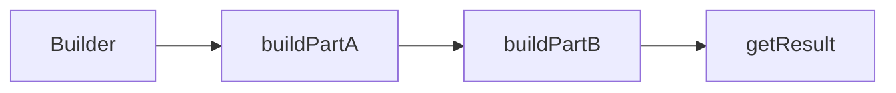

# 09-建造者模式（答案）

- 返回题目：[./../09-建造者模式.md](../09-建造者模式.md)
- 返回总目录：[设计模式面试体系](../README.md)

## 一句话定义
将复杂对象构建过程分步拆解，提升可读性和可控性。

## 关键知识点
- 适合参数多、步骤有先后约束的对象。
- Director 可选：复杂流程保留，简单场景可省略。
- 链式 Builder 可读性好，但要做参数完整性校验。

## 图解（Mermaid）

## 面试答题模板（30~60秒）
1. 先说定义：将复杂对象构建过程分步拆解，提升可读性和可控性。
2. 再说适用场景与优缺点。
3. 最后给一个 C++ 落地点（接口抽象、智能指针、生命周期管理）。

## 关联概念跳转
- [工厂方法模式题目](../02-工厂方法模式.md)
