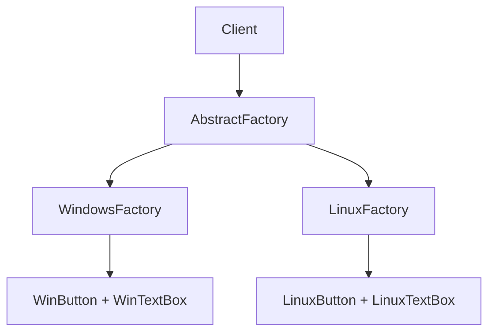

# 10-抽象工厂模式（答案）

- 返回题目：[./../10-抽象工厂模式.md](../10-抽象工厂模式.md)
- 返回总目录：[设计模式面试体系](../README.md)

## 一句话定义
为一组相关或相互依赖的对象（产品族）提供统一创建接口。

## 关键知识点
- 关注“产品族一致性”，如同一平台下按钮 + 输入框 + 菜单风格一致。
- 新增产品族容易；新增产品等级通常需要改所有工厂接口。
- 常用于跨平台 UI、数据库驱动族、硬件驱动族。

## 这种模式的好处
- 保证同一产品族的兼容性和一致性。
- 客户端只依赖抽象层，切换产品族成本低。
- 减少“混搭不兼容产品”带来的运行时问题。

## 实际例子（面试可直接复述）
跨平台 UI 框架：WindowsFactory 创建 WinButton/WinTextBox；LinuxFactory 创建 LinuxButton/LinuxTextBox。

## 流程图（Mermaid）

## 面试答题模板（30~60秒）
1. 先下定义：为一组相关或相互依赖的对象（产品族）提供统一创建接口。
2. 再讲一个真实业务例子，说明“为什么要用它”。
3. 最后补充优势与边界（什么时候不该用）。

## 关联概念跳转
- [工厂方法模式题目](../02-工厂方法模式.md)
