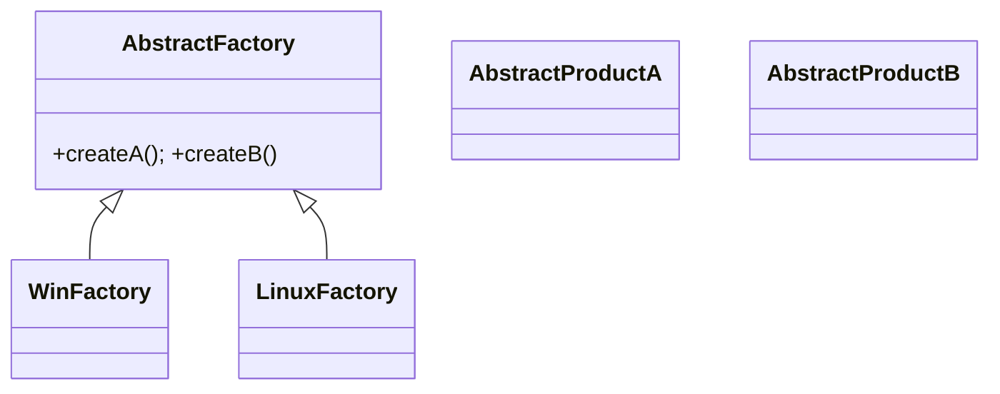

# 10-抽象工厂模式（答案）

- 返回题目：[./../10-抽象工厂模式.md](../10-抽象工厂模式.md)
- 返回总目录：[设计模式面试体系](../README.md)

## 一句话定义
创建“同一产品族”的一组对象，保证族内兼容。

## 关键知识点
- 新增产品族容易（新增工厂实现）；新增产品等级较难（改所有工厂接口）。
- 适合跨平台组件切换，如 Windows/Linux UI 套件。
- 若维度单一可降级为工厂方法，降低复杂度。

## 图解（Mermaid）

## 面试答题模板（30~60秒）
1. 先说定义：创建“同一产品族”的一组对象，保证族内兼容。
2. 再说适用场景与优缺点。
3. 最后给一个 C++ 落地点（接口抽象、智能指针、生命周期管理）。

## 关联概念跳转
- [工厂方法模式题目](../02-工厂方法模式.md)
